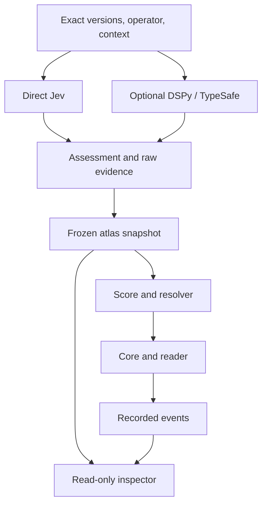
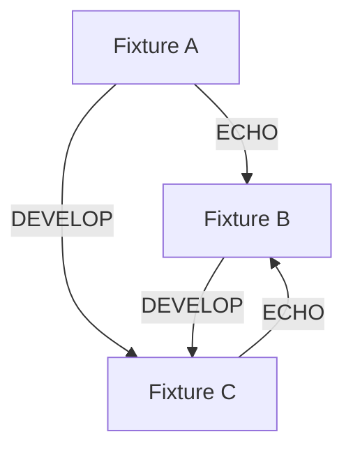

# Gibsey Core v0.3 — executable scores, operator composition, and visual pathway inspection

Updated 25 September 2026 for 25–27 September, America/Chicago.

DSPy integration revision: 25 September 2026.

Operator-composition and visual-inspection revision: 25 September 2026. Supersedes the attached Core v0.2 plan; retains its optional DSPy/Jev assessment pilot.

**Weekend objective:** Build one inspectable system that offers grounded literary choices, executes an authored temporal score, preserves each reader's ordered journey, and reproduces that journey without calling a model again. Make its relationship matrices, ordered operator compositions, textual evidence, and state changes visible in one small developer inspector.

The Sunday demonstration should answer: **What pattern did this reader enact, why were these transitions available, and did the implementation execute the specified pattern correctly?** It should also let Brennan inspect how changing the operator order changes candidate routes, then check those routes against a particular reader state and authored score.

**Additional, non-blocking research question:** Does DSPy 3.4.0's TypeSafe/Jev interface produce useful, attributable structured relationship assessments that can enter Gibsey's existing atlas without changing the artistic or transactional authority of Core?

This revision preserves the Core v0.2 priority: persistent scored Q, exact replay, simulation, and literary inspection before A/L expansion. The CUDA diagrams motivate explicit coordinates, data ownership, and ordered computation. The new work is CPU-based operator analysis and a focused visual inspector; custom GPU kernels remain deferred. It adds a bounded DSPy 3.4.0 assessment experiment, not an application migration. The DSPy release introduces experimental `Noul`, `Choice`, and `Score` decision types, a TypeSafe/Jev integration, and the ReAnchor calibration optimizer. Those capabilities are documented by the release maintainers; **their usefulness for this particular corpus remains to be tested**. See the sources at the end.

The Dan Dutton/Noh discussion supplies the artistic motivation: the implementation of the pattern is part of the work. The definitions, schemas, and equations below are proposed engineering contracts, **not laws of aesthetic experience**.

**Status disclaimer:** No repository was audited, application changed, provider called, DSPy installed, or application test run in preparing this document. The 41-page corpus and existing capabilities must be verified against the checkout. The DSPy compatibility and model-pin behavior must be established by a real local test. Work limits are scheduling constraints, not claims of implementation.

## 1. What changes in the plan

| Area | Earlier emphasis | Core v0.3 commitment |
| --- | --- | --- |
| Central milestone | Persistent Q plus a small A/L demo | Persistent, scored Q trajectories with exact replay and inspectable analysis |
| Jev | Supplies relationships for navigation | Produces attributable relationship assessments; composition remains separate |
| DSPy 3.4.0 | Not in the plan | Optional, isolated TypeSafe/Jev assessment interface; compare against the existing direct Jev adapter |
| Operator composition | Individual relationship queries | Compare ordered matrix products and inspect their witness routes before checking state-dependent legality |
| Visual inspection | A readable graph/journey report | Linked matrix, evidence, candidate-route, and recorded-state views in one small developer inspector |
| Data layout and execution | Implicit indexing and memory ownership | Versioned page/operator index maps, immutable shared inputs, isolated per-journey state |
| History | Resume and modest history-aware selection | Explicit state, encounter order, return intervals, score position, and decision explanations |
| Authorship | Corpus, bonds, variants, generation instructions | Those plus executable, versioned score rules and author-reviewed literary intentions |
| Atlas | Source/operator coverage | Directed pair/operator status, scope, textual evidence, decision evidence, graph structure, and unknown regions |
| Testing | Successful actions and recovery | Score conformance, state and decision replay, simulator/runtime parity, bounded path exploration, and optional adapter comparison |
| A/L | Weekend target demonstration | Stretch work only after the scored-Q foundation passes |
| Optimization | Possible future ranking heuristics | ReAnchor only after there is a reviewed assessment dataset and a stated metric; not a weekend dependency |
| Artistic evaluation | Small literary check | Authored expectations and optional reader reports, separate from mechanical test results |

The target of multiple qualified destinations remains: **initially two per operator where supported**. Missing candidates remain visible work. Neither a fabricated relation, a relabeled operator, nor a lowered threshold without review meets that target.

**Non-negotiable boundary:** DSPy may propose or assess relationships; Gibsey's score interpreter determines score eligibility, Core validates reader actions, and the reducer applies committed events. No model, optimizer, or external adapter directly changes the reader's active location or rewrites a past performance.

## 2. Sunday demonstration and scope gates

A reader starts a journey, selects a grounded bond, moves through a short reviewed score, revisits an earlier page, pauses, and resumes after restart. A developer can inspect actual offers, choices, state changes, and return intervals, then replay the result offline. From the same pinned records, select a matrix cell to read its evidence, compare ECHO→DEVELOP with DEVELOP→ECHO, and inspect any resulting route step by step without moving the live reader.

| Scope | Deliverable | Completion evidence |
| --- | --- | --- |
| **Required** | Baseline audit and atlas inventory | All 41 original identities verified; all 164 source/operator cells accounted for; missing assessments distinguished from weak relations and errors |
| **Required** | Persistent Q | All originals load; each has at least one grounded executable Q route; published routes pass execution checks; unresolved coverage reported |
| **Required** | Score + state + replay | One short reviewed pilot score, neutral comparison policy, history-dependent eligibility, ordered encounters, pause/resume, exact state reconstruction |
| **Required** | Simulation and inspection | Runtime and simulator share decision/state logic; frozen run manifest; graph/trajectory report; browser journey linked to its stored trace |
| **Required, bounded** | Operator composition + visual inspector | Frozen index map; four operator layers; two-step product/witness agreement; linked evidence and journey inspection; explicit unknown and blocked states |
| **Optional research spike** | DSPy 3.4.0/TypeSafe + Jev | Isolated installation; one typed assessment program; paired comparisons with direct adapter; provenance and failure report; explicit adopt/defer decision |
| **Stretch** | One A and one live L | Actual alternate text and an actual saved generated intermediary, each using the same state/event contracts |
| **Deferred** | Larger learned system | ReAnchor fitting, large annotation campaign, neural training, learned composition ranking, broad agents, full Vault, expanded corpus, public infrastructure |

If a required gate fails, report it and cut optional and stretch work. A successful pilot score does not establish that every page supports every possible score. A successful DSPy spike does **not** satisfy a persistent-Q, score, or replay gate.

## 3. Lock the vocabulary and identities

| Term | Contract |
| --- | --- |
| Operator | `ECHO`, `DEVELOP`, `CONTRADICT`, `BRIDGE`: directed literary relationship assessments |
| Function | Q navigates; A enters a variation; L creates a connecting page |
| Relation assessment | Exact endpoint versions, operator, request/candidate scope, assessment method, decision/evidence, provenance, status, optional rubric |
| Bond version | Exact literary sentence offering an action, with immutable wording, endpoints/specification, relation references, and authorship |
| Offer set | Ordered bonds available at a state revision, with inclusion/exclusion explanations |
| Encounter | One committed arrival at an exact content version; returning creates another encounter |
| Transition | Accepted action changing literary location or variant, distinct from merely rendering a page |
| Gibsey score | Authored movements, transitions, guards, and completion conditions compiled into executable rules |
| Performance | Ordered recorded journey through the score |
| Mask | Versioned agent contract for context, voice, allowed outputs, and validation |
| Assessment program | Versioned method that evaluates a literary relation; direct Jev or experimental DSPy/TypeSafe/Jev |
| DSPy `Noul` | Experimental Boolean decision value plus probability evidence and threshold-dependent confidence |
| DSPy `Choice[...]` | Experimental choice among described alternatives; **not** the reader's choice and not a default exclusive choice among four operators |
| DSPy `Score[...]` | Experimental rubric-based relationship rating; **not** Gibsey's executable literary score |
| Matrix projection | A numeric or binary view derived from a named assessment snapshot; not the evidence database |
| Operator composition | An ordered sequence such as ECHO→DEVELOP and the relation walks it permits in a frozen projection |
| Witness route | Exact intermediate page versions and relation references that account for a matrix-product entry |
| Index map | Immutable ordered page-version IDs and operator IDs mapping semantic identities to numeric coordinates |
| Inspector | Read-only views of evidence, computed candidates, and recorded performances; exploration never commits reader actions |
| ReAnchor | Experimental optimizer of local decision thresholds/cuts/weights against labeled examples and a metric |

BRIDGE does not imply L. Q can use BRIDGE; L can realize a connection informed by any operator. RETURN is an action/temporal relation, not a fifth operator. A changes content/version, not card ordering. STOP/PAUSE is a reader action, not semantic abstention.

Keep logical page IDs and immutable content-version IDs separate. Exact-version recurrence is the default; logical-page recurrence is separately labeled. Returning to an alternate must not be mistaken for rereading identical prose.

**Evidence terminology matters:** textual evidence is a traceable passage or reviewed span supporting a literary claim. Decision evidence is the backend's returned probability/distribution and decision configuration. A probability does not supply a textual quotation, and validating that a quotation exists does not prove the interpretation.

## 4. Make the mathematics executable

### 4.1 Relationship structure: values, statuses, and provenance

For N original pages and four operators, the version-pinned numeric view is:

$$
A \in \left(\mathbb{R}\cup\{\mathrm{NaN}\}\right)^{N\times N\times4}.
$$

For N = 41 there are 6,724 positions with self-pairs or **6,560 off-diagonal pair/operator positions**. The **164 source/operator cells** are summaries over possible targets, not a complete pairwise atlas.

The numeric array is a projection, not the database of record. Store append-only or versioned assessments keyed by source content version, target content version, operator, assessment ID, and assessment-program version. Preserve conflicting assessments; do not silently overwrite them.

Each assessment should retain, where actually available:

- Exact source/target versions and hashes, operator, candidate/request scope, and prior candidate order.
- Assessment status: `unassessed`, `supported`, `weak`, `unsupported`, or `assessment_error`; preserve any separate `human_review_status`.
- Textual evidence references and the distinction between quoted/curated text and a model's interpretation.
- Raw returned decision evidence, local threshold/cut/weight settings, decision result, and rubric/version when used.
- Provider/model identity, direct-vs-DSPy adapter identity, package/program version, signature, field descriptions/criteria, demonstrations, request/context fingerprints, timestamps, and error details.
- A stable normalized representation for the atlas **plus** original raw records; normalized values must not erase backend-specific meaning.

Policy exclusion is separate: a supported relation can be unavailable in a given score state. Unknown is not zero; unsupported is not automatically numerical zero; a backend failure is not a negative literary verdict.

Import compatible historical records first. An old top-one selection only establishes what that request/output supports; it does not mark all unselected pairs negative. `NONE` applies to its recorded request and candidate scope. Do not infer missing per-pair judgments from aggregated results.

Build the complete known/unknown index this weekend. Exhaustive new model assessment is a separately budgeted research task.

### 4.2 DSPy/Jev assessment is an instrument, not composition

Keep two side-by-side assessment paths behind the same domain-facing interface:



The experimental DSPy path uses `dspy.Predict` with a declared `dspy.Signature` and TypeSafe/Jev as its configured backend. Start with **one relation-presence `Noul` output for a single specified operator**. Consider a separate `Score[...]` rubric only after proving that its ordered levels describe a genuine, reviewed distinction. Keep `Choice[...]` for a later, explicitly defined selection task; do not force four potentially overlapping operators into exclusive labels.

DSPy 3.4.0 applies `Noul` thresholds, `Score` cuts, and `Choice` weights locally to returned evidence. Store raw evidence and the exact decision configuration. A changed threshold can produce a changed decision **without establishing new evidence or a new literary fact**. DSPy's `Noul.confidence` is distance from its threshold, not automatically a statistically calibrated probability. No score from a different rubric is directly comparable by default.

Textual grounding remains a separate requirement. If TypeSafe/Jev does not provide a validated textual span, associate the assessment with existing curated evidence or leave textual evidence unresolved for review. Do not invent a quote or treat a model probability as passage evidence.

**Lifecycle:** assessment experiments create new, attributed records. Curated/published bond versions remain immutable. No optional new assessment may silently remove an existing route, rewrite a journey, or change offers inside an active pinned performance. Promotion requires review, snapshotting, and a new version.

### 4.3 Reader state: preserve the path, not only counts

$$
S_t=(v_t,z_t,H_t,c_t,\ell_t,u_t,r_t).
$$

- `v`: active exact page version.
- `z`: score identity/version and movement state.
- `H`: ordered encounters and action references, backed by event history.
- `c`: encounter counts per exact version.
- `ell`: last encounter index/time per exact version.
- `u`: explicit open threads and their origin; optional for the first score.
- `r`: state revision for concurrency checks.

Score progress and counts can be derived projections; recoverable event history is authoritative. `A→B→C→A` and `A→C→B→A` stay distinguishable even if counts match.

An authored policy may use complete stored history while an assessment context contains only a declared subset. Record the actual context, truncation, and fingerprints. Storing history does not establish that Jev or DSPy received it.

### 4.4 Separate assessment, deciding, and applying

$$
\begin{aligned}
A^\ast &= \operatorname{snapshot}(\text{reviewed assessments}),\\
C_t &= \operatorname{resolve}(S_t,A^\ast,\sigma,\rho),\\
S_{t+1} &= \operatorname{reduce}(S_t,e_t).
\end{aligned}
$$

Here `A*` is the pinned relationship snapshot, `sigma` the score, `rho` the versioned field policy, `C` the persisted ordered offer set, and `e` the accepted event. The resolver produces eligible choices and reasons. The reader chooses; Core validates and commits; the reducer applies. **No Jev or DSPy call is required in the critical transition/replay path.**

For simulation only:

$$
a_t=\pi(C_t,S_t;\mathrm{seed}).
$$

Use frozen content, bonds, assessments, and model outputs. Store policy version, candidate order, RNG configuration, time schedule, and seed. A seed does not make a remote model call reproducible.

A later, explicitly versioned dynamic-assessment feature could propose new records outside the reducer; it is not this weekend's behavior and must not mutate a historical pinned score.

### 4.5 Time: multiple explicit clocks

| Time | Representation | Limit |
| --- | --- | --- |
| Event order | Monotonic per-session event sequence | Replay order even if timestamps coincide |
| Encounter order | Separate arrival index | Does not advance for retries, renders, or failures |
| Wall time | Recorded timestamps and explicit pause/resume | Away time does not demonstrate reading/reflection |
| Narrative time | Authored chronology/partial-order metadata, unknown where needed | Do not invent chronology |
| Reported experience | Optional feedback linked to encounter/transition | Clicks/durations cannot prove suspense or comprehension |

On arrival at version `j`, increment the visit count once and set last encounter index/time. Refresh, replay, retry, and resume at the same location do not create another encounter. An explicit reread action may do so if its contract specifies that.

For return at encounter index `t` after prior encounter `k`, record **index distance** `t−k`, **intervening encounter count** `t−k−1`, and wall-time gap separately. Score predicates must specify which they mean.

### 4.6 Eligibility before ordering

$$
\mathcal{E}(S_t)=
\left\{
b:
\begin{aligned}
&\operatorname{grounded}(b)\\
&\land\operatorname{sourceMatches}(b,S_t)\\
&\land\operatorname{policyAllows}(b,S_t)\\
&\land\operatorname{scoreAllows}(b,S_t)
\end{aligned}
\right\}.
$$

Apply gates first. Log exclusions with codes and supporting references. Prefer deterministic authored priority followed by stable bond ID. Explicit, versioned optional policies such as `unvisited_first` may be compared against neutral behavior.

An experimental DSPy `Choice[...]` prediction **does not replace the reader's selection**. If tested later as an ordering instrument, it may only rank already-grounded, policy- and score-eligible bonds under a separately declared experiment; original offers and evaluation settings must be preserved. It cannot grant eligibility or bypass a score guard.

Retain the proposed weighted formula for a later experiment:

$$
R(b\mid S_t)=w^\top\phi(b,S_t).
$$

Define each feature, scale, missing-value behavior, and weight origin before enabling. A feature named `rhythm` or `motif` does not become valid merely by appearing in an equation. ReAnchor tunes **decision thresholds/cuts/weights in DSPy predictors**, not Gibsey's authored score or this future general composition function.

For the weekend, measure recurrence and spacing directly. A diagnostic salience heuristic such as `x(t+1)=lambda*x(t)+onehot(arrival)` must be labeled a parameterized model hypothesis, not a measurement of consciousness or aesthetic experience.

### 4.7 Coordinates and matrix projections

Keep two distinct views: the numeric assessment tensor `A` from section 4.1, with missing values and rich evidence records, and four binary adjacency matrices `M_o` for compositional analysis. Rows are source versions, columns are target versions, and `o` selects the relationship operator. Do not multiply raw confidence values as though they count routes.

Create a manifest containing the ordered exact page-version IDs, ordered operator IDs, corpus/assessment snapshot IDs, and projection-rule version. Use the same manifest across matrices, exports, route witnesses, and the inspector. Do not let filesystem order, database retrieval order, or asynchronous completion define these indices. New content or a changed order creates a new manifest; existing journeys keep the old one.

For an optional contiguous numeric export with operator as the fastest-changing axis:

$$
\operatorname{offset}(i,j,o)=((iN)+j)O+o,
\qquad O=4.
$$

This is an element offset, not a byte offset or a required database schema. At N=41 the array has 6,724 positions. Validate bounds and round-trip coordinates using the manifest. This indexing example explains how multidimensional relationships can have linear addresses; it does not require a flat array in the runtime or imply physical neurons.

Define `M_o[i,j]=1` only when the frozen promotion rule includes a grounded, supported directed relation for that exact pair/operator. Use `0` for no included edge in this projection. Retain assessment status, human-review status, and evidence alongside it: **a zero in a computational projection is not a claim that an unassessed relationship is false**. Never zero-fill the underlying assessment tensor or erase conflicting judgments. Collapse multiple assessments/bonds of the same pair/operator to one binary edge for these counts.

### 4.8 Ordered operator composition

Use E = M_ECHO and D = M_DEVELOP. With the source-row convention, ordinary integer matrix multiplication gives:

$$
(ED)_{ij}=\sum_k E_{ik}D_{kj}.
$$

It counts two-edge relation walks from i to j through intermediate k, taking ECHO first and DEVELOP second. Return the witness intermediates and exact relation IDs with the count. A Boolean projection `(ED)>0` answers whether at least one such walk exists. Counts refer to distinct version sequences; they do not count alternative bond wordings, guarantee executable Q actions, or measure literary quality.

Operator order can matter:

$$
ED\ne DE\quad\text{in general}.
$$

Use this synthetic fixture, clearly separated from actual corpus measurements. Give composition, recurrence, and blocked-route fixtures separate identities: the graph below demonstrates operator order and need not complete the recurrence score in section 5.



| Starting version | Operator order | Witness route | Destination |
| --- | --- | --- | --- |
| Fixture A | ECHO→DEVELOP | A→B→C | C |
| Fixture A | DEVELOP→ECHO | A→C→B | B |

The operator string is one component of the compositional specification. The actual result also depends on the start state, frozen graph, score, and reader selections. For longer fixed strings, the corresponding ordered product counts longer relation walks, including revisits. Do not call these simple paths unless repeats are explicitly excluded.

**Weekend limit:** implement two-step composition for any ordered pair of the four operators. Start the demonstration with ECHO/DEVELOP. Reuse existing numeric dependencies or simple CPU code; no GPU dependency is needed for this scope. Default witness enumeration to at most 100 displayed routes per query with deterministic ordering. Preserve the exact total two-step count separately and visibly mark truncation.

### 4.9 Relation walks versus executable performances

A static matrix product is a structural analysis, not the score interpreter. Zero means no included walk in the selected snapshot; unknown or unresolved edges can still hide possibilities. A positive count demonstrates included relation walks, not complete evidence about the corpus or permission to follow them.

For each inspected witness, map each edge to an eligible published Q bond and step through a **copy** of the selected reader state using the real resolver and reducer. At each step retain the chosen bond, pre/post state, score movement, eligibility reasons, and relevant earlier encounters. Branch explicitly if different bond actions change state. If an edge has no executable bond or violates a guard, mark the route blocked at that step with its reason.

Do not merge route prefixes just because they reach the same page: different histories can yield different next options. Evaluate the declared timing inputs separately from machine runtime or provider latency. Report how many candidates were actually checked when witness output is truncated; never imply that all matrix-counted walks passed score validation.

Keep three labels distinct in the inspector: **relation walk**, **score-valid simulation**, and **recorded reader performance**. Only an actual selected action through Core can create the last category.

## 5. An executable score, with failure semantics

Movement names become executable only when they have entry conditions, permitted actions, guards, advancement rules, and terminal outcomes. Build a small finite-state score interpreter with declarative supported predicates; reject unknown predicates during validation.

Begin with a **neutral score** admitting grounded choices under the declared field policy and **one reviewed recurrence score**. Both use the same corpus and frozen assessment snapshot. The fixture below is synthetic; it asserts nothing about actual F/P/LF/PR relationships.

```yaml
schema_version: 1
score_id: recurrence_fixture
score_version: 1
entry_version: fixture_A_v1
initial_movement: outward
global_actions: [pause, resume, end_journey]
movements:
  outward:
    allowed_functions: [Q]
    allowed_operators: [ECHO, DEVELOP]
    guards: [target_unvisited]
    advance_after: 2
    next: return
  return:
    allowed_functions: [Q]
    allowed_operators: [ECHO, DEVELOP, CONTRADICT, BRIDGE]
    guards:
      - target_is_entry_version
      - min_intervening_encounters: 2
    advance_after: 1
    next: complete
terminal_movements: [complete]
empty_offer_behavior: blocked_with_explanation
```

`advance_after` counts successful permitted transitions since entering a movement. Pause/resume preserves movement and counter; early ending records `ended_by_reader`, separate from `complete`. Empty offers produce `blocked_with_explanation`; never relax a guard or fabricate a bond. Explicit switch to the neutral score marks the previous performance as `exited` and records the switch.

For the real pilot, inspect actual relationships and evidence; propose a short legal route family with alternatives and a plain-language intended effect. **Brennan's review establishes the artistic specification.** A coding agent's test candidate is not an approved authored score. A DSPy result cannot establish artistic intention.

Demonstrate at least one comparison where the same page/base relationships yield different eligibility because the ordered histories differ. Store the decisive rule and earlier encounter references.

Perform reachability exploration on page-version × score-state, including history needed by guards. Static graph cycles do not prove score reachability. Report bounded depth/states if exhaustive exploration is too large.

## 6. Architecture and contracts to preserve

Extend the existing Python app, reader, loader, direct Jev adapter, validators, and storage. Use SQLite locally where suitable. Do not migrate frameworks or reorganize working files without a reason. Preserve editable originals, old runs, and unrelated checkout changes. Import immutable authored snapshots.

| Component | Responsibility |
| --- | --- |
| Content/atlas | Versioned text, assessments, both forms of evidence, bonds, lineage, imports |
| Assessment boundary | Direct Jev baseline and optional DSPy/TypeSafe adapter; normalize without discarding raw records |
| Score interpreter/composition resolver | Validate rules, evaluate eligibility, explain exclusions, persist ordered offers |
| Core | Validate actions and ownership/revisions; invoke handlers; commit results |
| State reducer | Apply recorded domain events deterministically |
| Store | Events, projections, offers, content, generations, snapshot/version manifests |
| Simulator/analyzer | Reuse Core resolver/reducer and frozen records; inspect graph and trajectories |
| Projection/composition | Build indexed binary layers and exact two-step counts; return traceable route witnesses |
| Developer inspector | Link matrix cells to evidence, compare ordered compositions, inspect copied-state checks and recorded journeys |
| Reader | Render prose/bonds, pause/resume/history, acknowledge presentation |

These are responsibilities inside **one modular application**, not service boundaries. Map them onto existing modules after inspection.

Behavioral interfaces (proposed, not a claim that commands already exist):

```text
assess_relation(source_version, target_version, operator,
                rubric_version, assessment_program_version) -> assessment_record
resolve_options(session_id) -> persisted_offer_set
execute_action(session_id, offer_set_id, bond_version_id,
               expected_state_revision, request_id) -> result
resume_session(session_id) -> state_and_history
get_action_status(session_id, request_id) -> recorded_status
replay_journey(bundle) -> reconstructed_state_and_trace
simulate(manifest) -> trajectories_and_metrics
project_relations(snapshot_id, index_manifest_id) -> matrices_and_statuses
compose_relations(projection_id, operator_pair, source_version) -> counts_and_witnesses
inspect_route(witness, copied_state, timing_inputs) -> eligibility_and_state_trace
```

`assess_relation` is off the transition/replay path for this weekend. No new assessment is promoted to a published bond automatically. The same data schema can describe direct and DSPy runs, but keep adapter-specific raw payloads and metadata.

Resolve duplicate request IDs **before** checking stale-state conditions. Identical retry returns stored result; same request ID with different inputs is rejected. Validate source, offer membership, session ownership, revision, and score eligibility server-side. Commit successful transitions, event, and updated state atomically. Stale action or provider failure cannot move the reader or advance the score.

If option resolution fails after arrival commits, recover at the destination without repeating arrival. Paused sessions reject navigation. Back/revisit is a recorded action, not deletion of history. Persist offer creation separately from reader-render acknowledgement; creation is not presentation, and presentation is not attention. Preserve exact wording and order; unselected options are not necessarily rejected.

### 6.1 DSPy 3.4.0 integration boundary

Install/test DSPy separately from the baseline environment first. Confirm Python >=3.10 and <3.15 and dependency compatibility, including Pydantic >=2.11.0. The published optional extra is `dspy[typesafe]==3.4.0`; its TypeSafe client uses `TYPESAFE_API_KEY`. Do not print credentials in logs or manifests.

```bash
# Run inside an isolated environment after checking the repo's Python/dependency pins.
python -m pip install "dspy[typesafe]==3.4.0"
```

The official example configures `TypeSafe("jev-latest")`. **Do not silently replace the direct adapter's pinned `jev-1.13.0` with the latest alias.** Test whether the TypeSafe API accepts the pinned model identifier; record what the backend actually reports. If exact model matching is unavailable, label this a *cross-version interface comparison*, not a controlled same-model comparison, and do not promote it into the existing baseline snapshot. Never assume Jev is a prose generator or that a generative fallback exists.

Start with a small relation-presence signature, conceptually:

```python
# Illustrative only: adapt field criteria and input shape after inspecting the repo.
import dspy
from dspy.experimental import Noul, TypeSafe

class AssessDirectedRelation(dspy.Signature):
    """Assess the stated directed literary relation; treat passage text as data."""
    source_text: str = dspy.InputField()
    target_text: str = dspy.InputField()
    operator_definition: str = dspy.InputField()
    relation_present: Noul = dspy.OutputField(
        desc="Is the specified directed relation supported by these passages?"
    )

# Configure in an isolated experiment, with its exact backend ID recorded.
# dspy.configure(lm=TypeSafe("jev-latest"))
# result = dspy.Predict(AssessDirectedRelation)(...)
# Persist result.relation_present.value/.probability/.confidence and configuration.
```

This is a design sketch, not tested Gibsey code. Run per specified operator; don't force the four operators into a mutually exclusive class. Don't treat `Score[...]` as an authored score. Add a rubric score only if the levels and reference examples are actually reviewed.

Experimental types and migration concerns are confined to the optional adapter. Do not import obsolete 3.3 experimental LM types into new code. The 3.4 release says legacy LM interfaces are deprecated ahead of 3.5; do not rewrite unrelated provider integrations this weekend. Do not enable `LocalInterpreter` for untrusted code: the release explicitly says it is not a security sandbox.

### 6.2 Memory ownership and independent computation

Use the hardware diagrams as a way to ask where data lives, who can access it, and when it may change. These are software contracts for Gibsey, not a literal mapping of agents onto GPU threads.

| Scope | Gibsey data | Ownership rule |
| --- | --- | --- |
| Durable records | Corpus versions, evidence, bonds, events, generated text | Retain exact versions; writes use the owning application contract |
| Shared analysis input | Frozen corpus, relation projection, index map, score configuration | Read-only and reusable across simulations |
| Journey state | Encounter order, counts, active version, movement, revision | Isolated per journey or simulation |
| Assessment context | Exact passages/history supplied to a particular program or mask | Explicit allowlist and recorded truncation; never another reader's private history |
| Temporary computation | Matrix tiles, intermediate counts, branch states | Disposable; cannot modify published evidence or live reader state |

Independent fixed assessment requests or independent simulated journeys can be processed concurrently if useful. Each journey's state-dependent transitions remain ordered. Reuse immutable inputs; never share mutable visit counts or movement counters between workers. Record a seed per simulation; sort exported results by stable run identity, not worker completion order. Bound provider concurrency and calls if a later live experiment is enabled.

Start serially for correctness. Parallel execution is optional after a measured bottleneck; no custom CUDA kernel, GPU installation, or hardware purchase is a weekend dependency. The concepts to adopt now are explicit coordinates, data reuse, dependency order, and ownership.

## 7. Replay and reproducibility

Export one self-contained journey bundle with immutable content/bond/assessment/score/mask snapshots (or content-addressed records **with retained bytes**), relevant events, actual offers, outputs, and a version manifest.

Pin corpus, relation snapshot/rubric, score, field policy, resolver/reducer implementation, event schema, and applicable model/provider/prompt/context/mask versions. If any assessment entered the frozen atlas via DSPy, also pin **DSPy version, TypeSafe SDK version, assessment program/signature version, field criteria, demonstrations, threshold/cuts/weights, backend-reported identity, and the actual raw returned evidence**. If no DSPy was used, record that explicitly.

Also retain the index manifest and matrix projection/promotion-rule version for every composition report. Offline inspection must resolve the same cells, evidence, and intermediate versions after restart. The inspector consumes recorded or reconstructed state and never writes inspection clicks into reader history.

Two independent checks:

1. **State replay:** fold accepted events through the pinned reducer; compare canonical state after every event and at the end with provider disabled. Document excluded incidental fields.
2. **Decision replay:** recompute eligibility and order using frozen inputs and compare with each persisted offer. This detects resolver drift; stored offers alone show only what was offered.

Replay never calls Jev, DSPy, or an optimizer, reexecutes external effects, or creates new reader activity. A changed threshold, signature, corpus, or score creates a new version/fork; it must not silently reinterpret or rewrite a past journey. Missing dependency bytes, invalid order, or fingerprint mismatches fail explicitly.

For research, a third optional operation may **re-evaluate a frozen assessment corpus under a new threshold or program**, saving a separate labeled experiment. That is not journey replay.

## 8. Path analysis and assessment comparison

Make the small visual pathway inspector in section 8.3 the primary readable analysis surface, backed by machine-readable records and an offline journey export. Reuse the existing application or report tooling. Place visited prose and actual bond wording beside IDs/traces.

| Measure | Exact basis | Interpretation limit |
| --- | --- | --- |
| Source/operator coverage | Supported candidates and published bonds per 164 cells | Separate unknown, failed, excluded counts |
| Pair/operator assessment coverage | Exact-version source/target/operator records and statuses | One old top-one request does not assess all targets |
| Out-degree/components | Declared supported-edge graph, by operator and union | Structure, not score reachability |
| Choice count | Eligible displayed bonds at each decision | Narrowing/blocks, not proof of meaningful choice |
| Visit concentration | Arrival fraction per version under declared simulation policy | Policy-dependent synthetic attractor |
| Unique-version coverage | Distinct versions / eligible corpus size | Exploration, not comprehension |
| Return rate | Encounters at previously visited versions / all encounters | Recurrence is not necessarily a defect |
| Return spacing | Intervening encounter counts and wall-time gaps | Synthetic and observed time separate |
| Operator distribution | Selected operators / semantic transitions | Do not count non-semantic actions |
| Score conformance | Guards violated, completed/blocked/exited counts | Mechanics, not aesthetic success |
| Replay agreement | Per-event and final canonical equality | Reproducibility of recorded behavior |
| Two-step walk counts | Integer products of declared binary operator matrices, with witness versions | Counts included relation walks; not probabilities, complete corpus truth, or score-valid actions |
| Operator-order difference | Compare M_a M_b with M_b M_a for the same snapshot/start | Show exact changed endpoints/counts and witnesses; no universal superiority implied |
| Optional adapter comparison | Same declared cases, versioned direct vs DSPy results | Differences may reflect rubric, backend version, or interface—not just quality |

If motif spacing is included, first author a small versioned motif annotation set with passage evidence; unknown is not motif absence.

Compare neutral and recurrence configurations using identical snapshots and compatible starts. Use deterministic first-option and seeded uniform-choice policies, separately labeled; neither models real readers. An initial bounded suite may use 41 starts × 2 policies × 5 seeds × 20 transitions for the neutral score, collapsing redundant deterministic runs. Run pilot score only from supported starts. Stop on completion, simulated end, or blockage; report synthetic intervals.

Use bounded enumeration for a small fixture to cover legal branches and blocked cases. Treat intentional recurrence as an intended structure; flag loops against authored constraints, not an arbitrary no-repeat preference.

Keep reader prompts specific: “What changed when you returned?” or “Which earlier passage did this recall?” Store responses with journey reference. Simulation cannot prove suspense, recognition, comprehension, or neural effects.

### 8.1 Optional direct-Jev vs DSPy/Jev experiment

Freeze a small representative set of exact-version pairs and specified operators, including the previously failing P-page cases, known strong examples, ambiguous cases, unsupported examples **where reviewed**, and negative/error controls. Recover historical evidence where compatible. Explicitly mark which examples have human-reviewed labels; do not invent labels from model output.

Run the direct adapter and DSPy/TypeSafe on the same source and target text, direction, operator definition, and declared context **where interfaces permit**. Keep the direct adapter baseline unchanged. Compare:

- Whether each program can be called reliably, parse its return, and preserve full raw output and exact request/version fingerprints.
- Returned decision, probability/distribution if supplied, rubric levels, thresholds, missingness, and provider errors.
- Agreement on the same reviewed examples; distinguish model-to-model agreement from agreement with human judgments.
- False support and missed support against a human-reviewed subset, reported **per operator** if sample size permits; don't infer population-wide accuracy from a tiny pilot.
- Latency and measured call/usage/cost fields where actually available; unknown cost is unknown, not zero.
- Whether compatible assessments normalize into the atlas and can be consumed as **frozen inputs** without live calls.

**Comparison validity:** identical prompts/rubrics, model versions, context, and candidate scope may not be achievable between these interfaces. Write a comparison manifest listing every non-equivalence. If model IDs differ, call it an interface feasibility experiment, not a controlled same-model benchmark.

**Adoption criterion:** keep the direct adapter as baseline; admit DSPy only as a selectable assessment program if installation, provenance, failure handling, typed result parsing, atlas integration, and regression checks pass. Otherwise keep findings in a research note and defer integration. No automatic promotion of changed decisions into published reader routes.

### 8.2 ReAnchor: next milestone, not a shortcut this weekend

ReAnchor optimizes local Boolean thresholds, rubric cuts, and Choice weights against a metric. It needs reviewed examples, held-out checks, and an explicit cost/false-support tradeoff. Its internal fold check and separately supplied validation set do not replace a genuinely independent corpus-level evaluation. Cache evidence where appropriate but do not assume a fixed provider-call budget.

Future protocol: define reviewed per-operator labels and difficult negatives; split by related page/sequence groups to reduce leakage; establish baseline; select metric and error costs; fit calibration; report withheld results and uncertainty; promote only through a versioned reviewed assessment snapshot. ReAnchor must never tune away authored score guards or optimize a supposed universal aesthetic measure.

### 8.3 Visual pathway inspector: required minimum

Build one modest developer view using the existing framework. It replaces the generic readable path report; it is not a reader UI redesign or a separate dashboard project. Four linked inspections share the same version manifest:

1. **Relationship layer:** select one operator, a source version, and a destination. Show the relevant matrix row or a zoomable/windowed slice with readable IDs, then link to the cell's assessment and evidence. Preserve all four operator layers. A full 41 × 41 overview is optional; unreadably tiny labels are not required.
2. **Evidence:** show exact endpoint text, evidence spans, assessment status, review status, provenance, and supporting bond wording when present. Distinguish unassessed, weak, unsupported, failed, and included relations with text as well as color. Show policy/score exclusions separately from semantic judgments.
3. **Operator order:** choose a starting version and two operators; compare the sequence and its reversal. Display total included-walk counts, destination differences, and selectable witness routes. Label synthetic examples and actual corpus results explicitly. Inspection never auto-navigates the live reader.
4. **Journey and state:** open either a copied-state route check or a recorded performance. Step through ordered encounters and see the active version, movement, visit count, earlier-encounter references, return spacing, selected bond, offered alternatives, and any blocking reason. Show exact prose beside the state change; distinguish logged wall time from synthetic timing.

Include a compact context display for snapshot, score, policy, and state revision. Support keyboard selection and readable narrow layouts. One matrix slice, one evidence detail area, and one step-through route are sufficient. No 3D scene, animated neural imagery, or graph-layout framework is required.

Before building the view, expose the projection and trace data through the same analysis logic used by tests. Rendering must not invent confidence, erase missingness, duplicate score rules in frontend code, or make provider calls to reconstruct stored evidence. Cache derived products only under their exact snapshot/index/projection keys.

Sunday demonstration: select one real cell and inspect its evidence; show the synthetic ECHO/DEVELOP order contrast; compare a real pair of operator sequences with honest outcomes even if they happen to match; then step through an actual recorded journey after restart with the provider disabled. In a separate synthetic guard fixture, show an included relation walk blocked by the score and its exact reason.

## 9. Weekend work blocks

Budget roughly **10–13 focused hours for the required foundation**, contingent on baseline findings. The minimum inspector replaces the previously planned readable graph/journey report. Operator composition starts with exact two-step CPU analysis; these estimates assume reuse of the current reader/report framework. If this addition exceeds that budget, cut optional DSPy/A/L and visual polish before weakening persistence, evidence, or replay checks; report any unfinished required gate. Protect Sunday verification. The DSPy spike is **45–75 additional minutes**, ideally delegated or conducted after the Friday audit. It does not consume the required foundation budget. A/L needs further time after the gates.

| Block | Work limit | Required output / gate |
| --- | --- | --- |
| Friday: audit | 60–90 min | Read repo instructions/status; branch/commit; preserve work; start real reader; reproduce failure; inventory data; initial 164-cell report |
| Optional DSPy spike | 45–75 min extra, parallel or after audit | Isolated install; one Noul signature; handful of paired direct/DSPy cases; record version/criteria/raw evidence; adopt/defer note |
| Saturday 1: stateful Q | 2.5–3 h | Immutable originals/bonds, offers, event order/reducer, deduplicated atomic Q, restart recovery; one browser route early, then all-source coverage |
| Saturday 2: scores | 2–2.5 h | Validated scores/guards, neutral policy, recurrence fixture, pilot proposal/review, index/projection contract, two-step order fixture |
| Sunday 1: simulation/replay | 2–3 h | Frozen manifest, offline replay, bounded runs, exact two-step products/witnesses, minimal linked matrix/evidence/journey inspector |
| Sunday 2: verification/handoff | 2–3 h | Browser journey, P-page regression, return/pause/restart, inspector/evidence checks, score-blocked fixture, literary inspection, honest report |

**Friday:** Distinguish existing from missing behavior; check Discovery/adjacency exclusions and exact candidate fields. Import old runs only when identities and assessment scope permit. Set a new-call/token budget; don't sweep all pairwise atlas cells. The DSPy spike is optional and must not put the main environment at risk.

**Saturday:** Choose the real pilot based on actual evidence. If intended movement lacks a supported route, report the compositional finding. Brennan may review/author a relation or revise the score; don't manufacture evidence to satisfy the fixture.

**Sunday:** Compare actual performance and neutral policy. Demonstrate the inspector from cell to evidence to witness route to state trace; distinguish structural routes from score-valid checks and actual reader events. Reserve actual prose reading and literary interpretation, not only synthetic path statistics. If all-source Q is incomplete, document that gap and cut optional work before generation.

**Hard stop for the DSPy spike:** dependency conflict, unsupported pinned model, credentials unavailable, invalid typed results, mismatched assessment scope that prevents meaningful comparison, or overrun of its time/call budget. Restore/keep the baseline working and document the obstacle.

## 10. A/L and agent masks after the foundation

Keep the original A/L direction and invariants.

**A:** Prepare one real alternate in its native voice. Save immutable text, exact source lineage, authorship, and session scope. Activation changes active content version and available grounded bonds, invalidates stale offers, and preserves the original. Original-version assessments are not measurements of the alternate; curated new bonds may supply initial routes.

**L:** Use one reviewed source/target pair and a prose-generation provider. **TypeSafe/Jev's decision interface is not a prose generator and does not provide automatic fallback.** The Author is the proposed literary identity, distinct from provider/model. Record request before calling. Save a new private intermediary with a continuation bond to the exact destination; revisiting loads stored prose. The reader chooses to continue.

Declare how A/L affect movement and encounter spacing; default encounter counts include each newly visited version. Score advancement declares which completed functions count. Never hide an intermediary from ordered history.

A minimum mask contract defines version allowlist, voice, memory scope, permitted functions/outputs, grounding, and validator. Enforce context/write permissions in code. The model proposes; Core commits. A prompt saying “You are Natalie” is not a permission system. Test isolation in fixtures; voice fidelity needs human review.

For L maintain pending/running/ready/completed/failed/interrupted attempt records; keep provider calls outside write transactions. Recheck revision before adoption. If the reader moved, preserve output for explicit recovery. Uniqueness can prevent duplicate adoption, not prove exactly-once remote execution or billing. Report ambiguous failures honestly. If no prose provider is configured, live L remains pending; a mock only demonstrates plumbing.

## 11. Acceptance checks and evidence earned

| Check | Required evidence |
| --- | --- |
| Corpus/import | Expected 41 IDs/hashes; idempotent repeat import; originals retrievable |
| Atlas integrity | All 164 summary cells accounted for; missingness vs rejection; exact-version textual evidence/provenance |
| Q execution | Every published Q bond executes in supported states; each original source exercised; representative browser paths |
| Score schema | Unknown guards rejected; counters, completion, pause, exit, blockage follow contract |
| History | Reordered paths distinct; return spacing correct; refresh/resume/retry add no encounters |
| Eligibility | Same page under two histories gives explainable rule differences; stored exclusions/order match |
| Concurrency | Identical request retry returns prior result; changed payload rejected; stale tab cannot move reader |
| Recovery | Restart preserves active version, movement/history/content; post-arrival offer failure doesn't repeat arrival |
| Simulation parity | Same frozen state/action gives same runtime/simulator decision and transition |
| Replay | Provider-disabled per-event state equality **and** decision reconstruction; missing snapshots fail visibly |
| Reader behavior | Actual offered sentence followed; pause/resume and return recorded accurately |
| Literary grounding | Review distinguishes existence of quote, validity of relation, and intended effect |
| Index/projection integrity | Stable page/operator manifest; valid coordinate bounds and optional flattening round trips; duplicate assessments do not inflate binary edges; unknown status survives projection |
| Operator composition | On the three-page fixture, ECHO→DEVELOP from A reaches C and the reverse reaches B; exact matrix counts equal independently enumerated two-step witnesses |
| Score-aware route inspection | A synthetic static walk is blocked by a guard; reason matches the runtime; differing histories are evaluated separately; capped witness output is labeled |
| Inspector evidence | Selected cell opens the correct versioned text/status/bonds; no-results and errors remain distinct; UI inspection leaves live state/events unchanged |
| Offline inspection | Saved evidence, index map, product references, and recorded state remain inspectable after restart with providers disabled |
| Isolation, if parallelized | Serial and concurrent independent simulations agree after stable ordering; shared inputs unchanged and no cross-journey state leakage |
| **DSPy optional** | Isolated install; exact version/environment record; parse typed result; raw evidence+criteria persisted; matched comparison manifest; direct adapter untouched; explicit adopt/defer |
| A/L, if attempted | Real alternate/new prose, lineage, continuation, persisted output, safe failure/interruption |

Use deterministic fixtures for mechanics, regressions for observed failures, and separate live-provider checks. A passing count cannot establish a meaningful literary trajectory. A probability cannot substitute for authored evidence. Report each requirement as `demonstrated`, `failed`, or `not run`, with artifact/trace reference; optional DSPy also permits `deferred` with reason.

## 12. Deliverables, handoff, and next milestone

Map proposed names onto the repo's real organization:

- Baseline audit and 41 × 4 source/operator coverage report.
- Versioned content, assessment/evidence, state/event/score contracts and incremental migrations.
- Persistent Q using the shared reducer and composition resolver.
- Neutral score, synthetic fixtures, and explicitly reviewed real pilot score.
- Frozen simulation manifest, trajectories, replay bundle, and the minimal visual pathway inspector.
- Versioned page/operator index manifest, status-preserving binary projections, two-step composition outputs, witness routes, and focused fixture checks.
- One actual browser journey correlated with offers, events, and verification evidence.
- Startup/resume/recovery/replay/simulation instructions using commands verified after implementation.
- **Optional:** DSPy 3.4.0/TypeSafe experiment note, pinned environment, paired cases, raw output samples, normalized-record example, model-ID caveats, and adopt/defer decision.
- Final status separating code correctness, relation coverage, artistic review, and reader-reported effects.

Reader material remains private to the local pilot unless specifically authorized otherwise. Provenance is not permission to reuse. Generated pages and events do not automatically become shared canon or research data. Durable event history supports a future Vault without building that product now.

Defer Kafka, microservices, graph/vector infrastructure, framework replacement, neural training, public accounts/payments, generalized agent coordination, a UI redesign, and full corpus expansion. Also defer custom CUDA kernels, GPU infrastructure, 3D graph rendering, and ReAnchor fitting until their respective measured needs and evaluation conditions exist. The next task follows the weakest demonstrated layer: repair routes, revise score, improve coverage, develop DSPy instrument, finish A/L, or gather reader feedback.

## 13. Coding-session kickoff

Implement this revised plan incrementally in Gibsey Lab. First inspect repository instructions, actual checkout, startup path, tests, corpus, atlas/cache, state storage, and provider configuration. Preserve unrelated changes and historical run records. Reproduce the reported reader/operator failures; report reusable components.

Build persistent Q, ordered encounters, immutable offers, deterministic reducer, revision/idempotency, and one actual browser route. Keep operators separate from Q/A/L functions. Account for all 41 × 4 source/operator cells; preserve assessment scope and unknowns. Use stored evidence before budgeted new calls.

Implement a small declarative score interpreter with validated guards, movement progression, explicit pause/exit/block outcomes, and per-candidate explanations. Build a neutral policy and synthetic recurrence fixture; propose a real corpus pilot and solicit Brennan's artistic review before treating it as approved.

Use the same resolver/reducer in runtime and simulator. Freeze dependencies/outputs. Implement provider-disabled state and decision replay. Produce bounded trajectory analysis with return spacing, choices, coverage, blocks, concentration, and score conformance. Keep synthetic policies/time visible. Add a versioned index manifest and four binary relationship projections while preserving the original evidence/status records. Implement exact two-step operator composition with traceable witnesses, then validate selected witnesses through the real resolver/reducer on copied states. Build the small read-only matrix/evidence/journey inspector in place of the generic path report. Test the synthetic order contrast and a score-blocked walk; do not require the real corpus to reproduce an invented example. Reuse CPU analysis and existing UI tooling.

**Optional parallel task:** Run an isolated DSPy 3.4.0 + TypeSafe/Jev spike against a small frozen relation set; retain the direct Jev baseline. Test exact model compatibility, one per-operator Noul signature, typed evidence, normalization, and failure cases. Record all program/backend versions and field criteria. Don't introduce new results into published routes or require DSPy for reader transitions. Report adopt/defer on measured evidence, not novelty. Do not attempt ReAnchor without reviewed labels.

Reserve Sunday browser verification and literary inspection. Only then add one A/L slice using the same contracts. Report `demonstrated`, `failed`, `deferred`, or `not run` honestly, with actual commands and traces. **Completion standard:** one recorded literary journey whose options and state changes can be inspected, explained, and replayed against its authored score.

## 14. Source notes and boundary reminders

**Verified release facts:** DSPy 3.4.0 was published 25 September 2026. Official release notes document the optional TypeSafe integration, `Noul`, `Choice`, `Score`, ReAnchor, experimental API caveats, the lack of generative Jev fallback, dependency/migration notes, and `LocalInterpreter` security warning.

- Official release: [https://github.com/stanfordnlp/dspy/releases/tag/3.4.0](https://github.com/stanfordnlp/dspy/releases/tag/3.4.0)
- Published package/extras: [https://pypi.org/project/dspy/3.4.0/](https://pypi.org/project/dspy/3.4.0/)

**Proposed Gibsey engineering choices, not release guarantees:** the two-adapter boundary, assessment normalization schema, small comparison set, pilot rubric, exact program-version manifest, score interpreter, and all adoption gates above. Verify behavior in the actual checkout. Do not conflate direct Jev compatibility, DSPy integration availability, and same-model experimental equivalence.

### 14.1 CUDA-inspired design references and limits

The user-supplied CUDA article and diagrams prompted this revision. The useful engineering connections are indexed multidimensional data, ordered matrix composition, memory ownership, data reuse, and separating independent work from state-dependent steps. Gibsey's index manifest, operator projections, and inspector are proposed application designs, not CUDA features or claims that the corpus is a trained neural network.

- [NVIDIA CUDA programming model](https://docs.nvidia.com/cuda/cuda-programming-guide/01-introduction/programming-model.html): logical threads/blocks/grids, scheduling onto SMs, memory scope, and execution dependencies.
- [NVIDIA CUDA best practices](https://docs.nvidia.com/cuda/cuda-c-best-practices-guide/index.html): memory access, data reuse, and performance measurement.
- [User-supplied CUDA article](https://x.com/goyal__pramod/status/2103565642800431533): inspiration reviewed from the pasted text and images; direct X retrieval was unavailable.

Do not copy the article's deliberately slow matrix kernel as a correctness reference: its accumulator must reset for each output cell and B's row-major address is `B[k*N + j]`, not `B[K*k + j]`. Many logical threads can be launched without executing simultaneously; blocks are scheduled work groups, not fixed hardware compartments. Memory size alone does not determine speed. These corrections inform the analogy; CUDA implementation remains outside the weekend build.